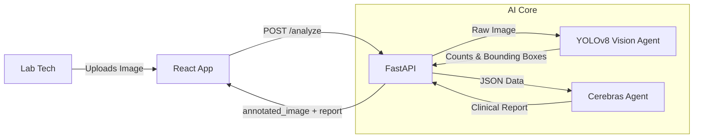

# MicroSmart PF

## 💡 The Solution

MicroSmart PF uses a **Tri-Agent Architecture** to replicate a pathologist's workflow:

- **👁️ The Eye (Vision Agent)**: A YOLOv8 model acts as the primary screener, detecting cells and drawing bounding boxes to "show its work."
- **🧠 The Brain (Reasoning Agent)**: The Cerebras Inference API (Llama 3.3) interprets counts and produces a WHO-compliant clinical report.
- **🖥️ The Body (Frontend)**: A React-based dashboard visualizes the Eye's findings (bounding boxes) and the Brain's diagnosis side-by-side.

---

## 🚀 Tech Stack

**Frontend**  
[](https://reactjs.org) [](https://vitejs.dev) [](https://tailwindcss.com)

**Backend & AI**  
[](https://fastapi.tiangolo.com) [](https://github.com/ultralytics/ultralytics) [](https://www.cerebras.net)

---

## 🛠️ Getting Started

### 1️⃣ Clone & Setup
```bash
git clone https://github.com/ujpm/microsmart_pf.git
cd microsmart_pf
```

### 2️⃣ Backend (The Brain)
Create a `.env` file in `backend/` with your API key (example, DO NOT commit this file):
```env
CEREBRAS_API_KEY="csk-REPLACE_WITH_YOUR_KEY"
```

Then install and run:
```bash
cd backend
pip install -r requirements.txt
python -m uvicorn src.main:app --reload --host 0.0.0.0 --port 8000
```

> Note: the server loads the Vision model at startup by default. If model loading is slow, consider lazy-loading or using the FastAPI startup event to preload models.

### 3️⃣ Frontend (The Body)
Open a new terminal:
```bash
cd frontend
npm install
npm run dev
```
Visit: `http://localhost:5173`

---

## 📄 API (short)

### POST /analyze
- Accepts: `multipart/form-data` with field `file` (image/jpeg|png)
- Response example:
```json
{
  "analysis": {
    "counts": {
      "Red_Blood_Cell": 120,
      "Trophozoite": 5
    },
    "parasitemia_pct": 4.16,
    "annotated_image": "base64-encoded-jpeg-string"
  },
  "report": "Based on the elevated trophozoite count ... (markdown text)"
}
```

Implementation notes:
- Vision Agent returns counts and an `annotated_image` (base64 JPG) for immediate preview.
- Parasitemia calculation includes safe-division logic to avoid crashes when RBC count is zero.

---

## 🧾 Troubleshooting

- **ModuleNotFoundError: No module named 'src'**
  - Ensure you run uvicorn from the backend/ root directory, not inside src/.
  - Correct Command: `python -m uvicorn src.main:app --reload`
- **Attribute 'app' not found**
  - This occurs if src/main.py is missing the `app = FastAPI()` definition. Ensure the entry point defines the application instance.

---

## 🗺️ Architecture Diagram



---

## 🏆 Optional Polish Ideas

- Add CI steps to lint TypeScript and run Python unit tests.
- Add `CONTRIBUTING.md` and `LICENSE` files for open source best practices.
- Add a full technical deep dive in `/documentation` (API contract, agent logic, deployment notes).
- Add more badges (build status, coverage, license) if you set up CI/CD.
- Add screenshots or GIFs of the UI and annotated images.
- Add links to dataset and model training scripts.

---

## 📜 License

This project is open source under the MIT License. See `LICENSE` for details.
